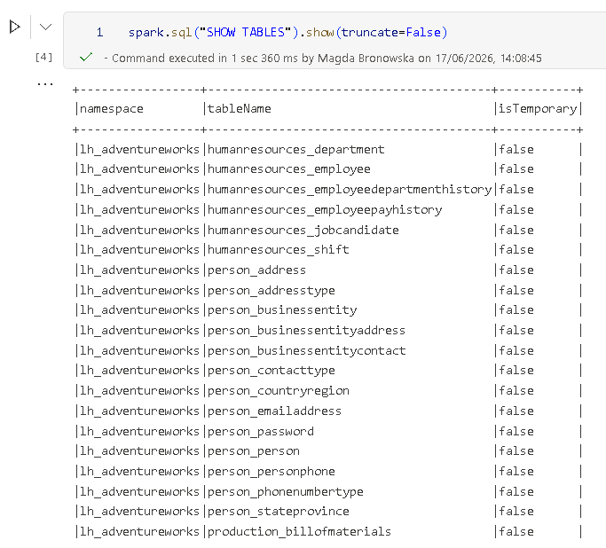
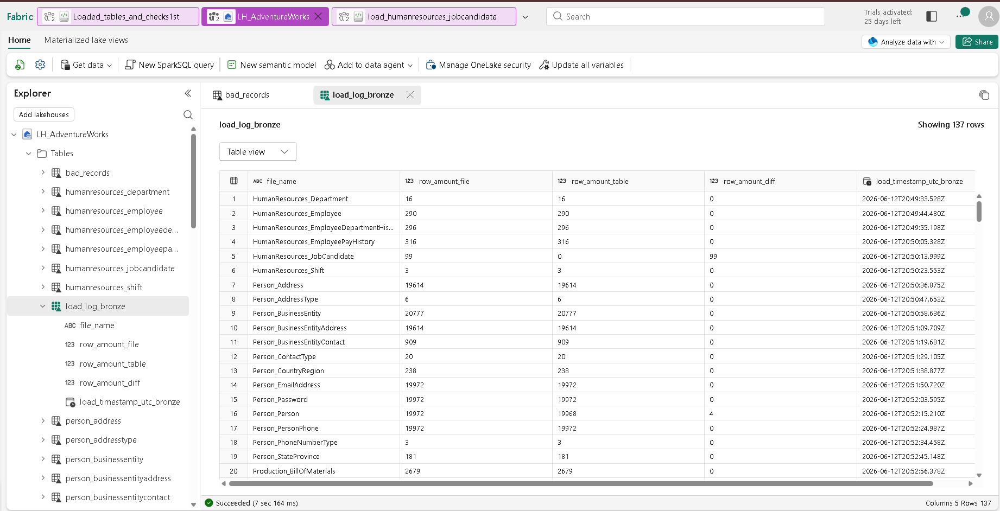
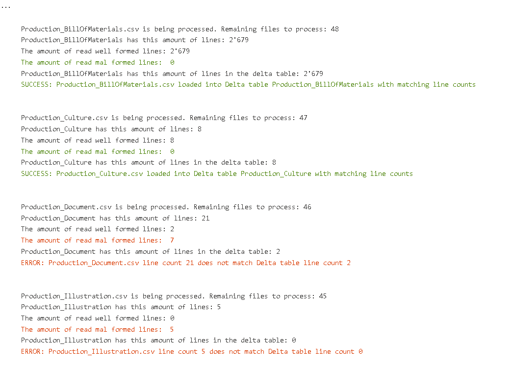
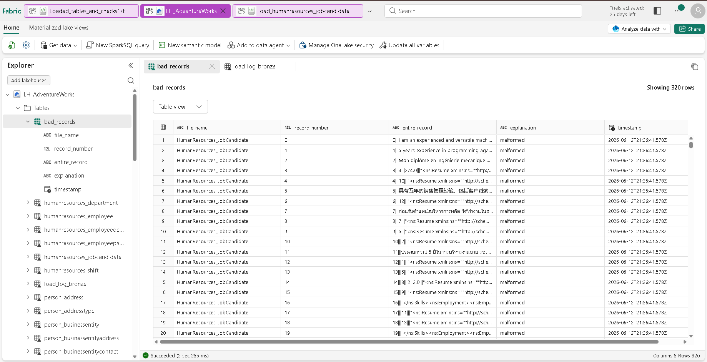
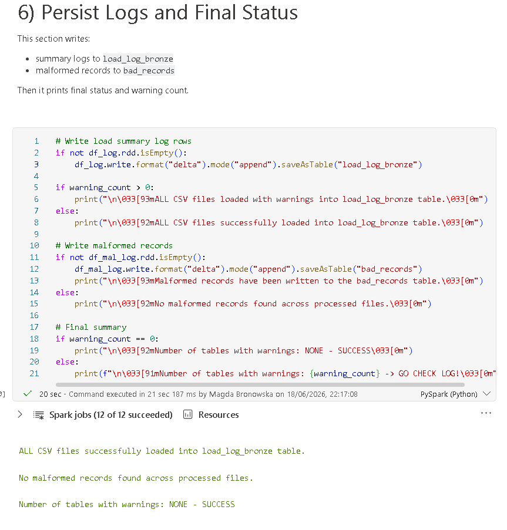

# IN PROGRESS

# AdventureWorks CSV to Microsoft Fabric Lakehouse

Additional README files in this folder:
- [README_short.md]([README_short.md]): one-page project summary
- IN PROGRESS: README_silver_layer.md: detailed Silver layer next-step plan

## Project summary
This project loads AdventureWorks CSV files from the Files area into Delta tables in a Fabric Lakehouse (Bronze layer), then logs data quality checks and malformed rows.

The goal so far has been:
- load many CSV files automatically
- create one Delta table per CSV file
- track row-count checks in a log table
- capture problematic rows in a bad-records table
- investigate load issues with dedicated debug notebooks

## What has been done so far

### 1. Initial bulk loader
File: load_csv_1st.py

[FILE](load_csv_1st.py)

[NOTEBOOK](loaded_tables_and_checks1st.ipynb)

Implemented:
- reads CSV files from Files/csv/csv
- converts file names like HumanResources.JobCandidate.csv to table names like HumanResources_JobCandidate
- writes data into Delta tables with overwrite mode
- logs row-count comparison into load_log_bronze
- writes malformed records into bad_records

### 2. Validation and investigation scripts
Files:
- [checks_of_loaded_tables.py](checks_of_loaded_tables.py)
- [Loaded_tables_and_checks1st.ipynb](loaded_tables_and_checks1st.ipynb)

Issues:
 - multiple ERRORS:
HumanResources_JobCandidate.csv is being processed. Remaining files to process: 63
HumanResources_JobCandidate has this amount of lines: 99
The amount of read well formed lines: 0
The amount of read mal formed lines:  22
HumanResources_JobCandidate has this amount of lines in the delta table: 0
ERROR: HumanResources_JobCandidate.csv line count 99 does not match Delta table line count 0 

Implemented:
- checks available tables and databases
- inspects bad_records content
- inspects load_log_bronze for successful and failed loads

### 3. Debug-focused loading path
File:
- [load_debug.ipynb](load_debug.ipynb)

Implemented:
- improved troubleshooting flow for parsing issues
- easier inspection of malformed rows and load mismatches

## Known issue discovered
A key issue was found with complex CSV rows (especially HumanResources_JobCandidate):
- the first approach compared physical text lines with table row count
- multiline XML/text fields can break this comparison
- this caused false row-count mismatch warnings

In short: line count and parsed record count are not always the same for multiline CSV files.

## Fabric tables created
Main output tables:
- one table per source CSV in the Lakehouse

Control and quality tables:
- load_log_bronze
- bad_records

## Screenshots

### Files and table inventory

### Logging and quality checks

### Bad record investigation

## Notes
This repository currently captures a practical Bronze loading workflow plus debugging artifacts. The next value step is turning this into a repeatable Bronze -> Silver -> Gold pipeline with monitoring and incremental loads.

