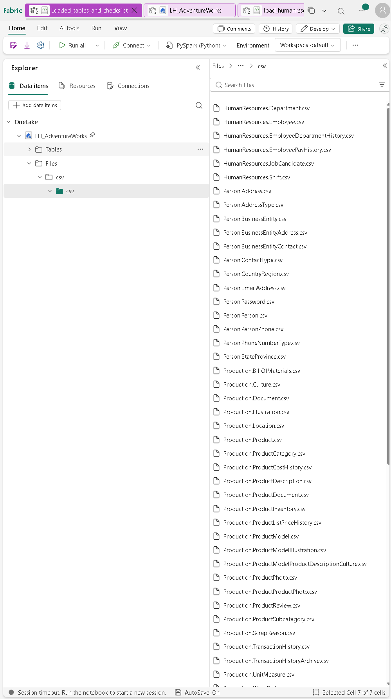
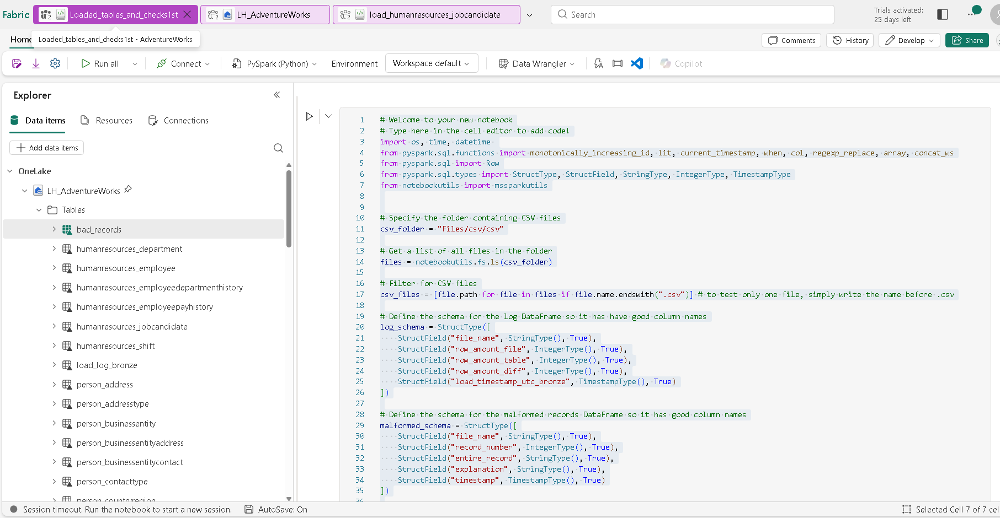
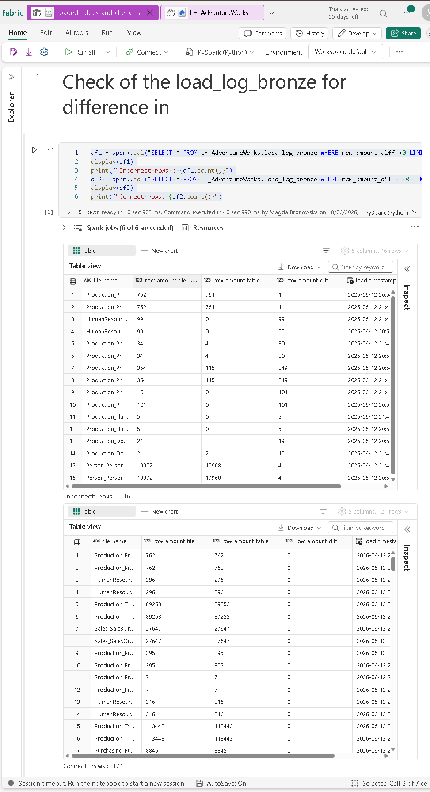
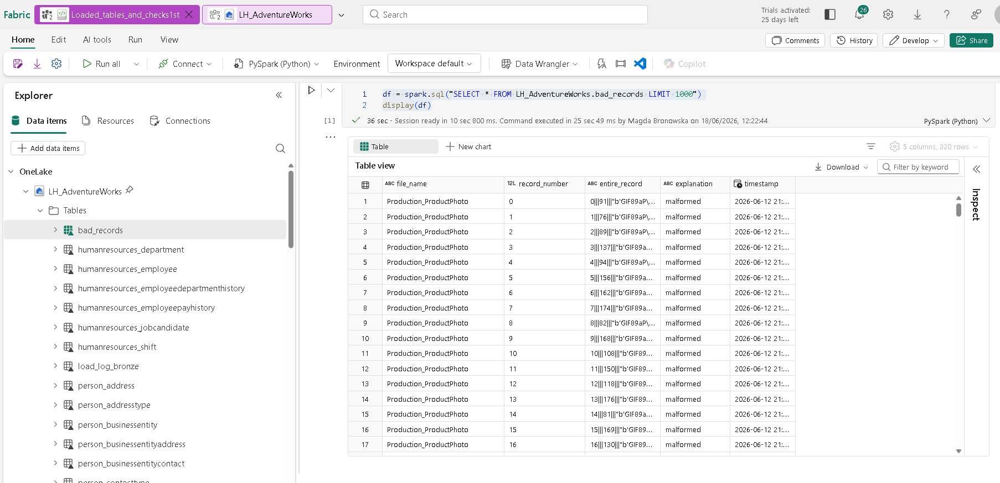

# AdventureWorks Fabric Loader - Short Summary

## What this project does
This project loads AdventureWorks CSV files into Microsoft Fabric Lakehouse Delta tables (Bronze layer), then logs load quality and malformed rows.

## Current status
Completed:
- automated CSV discovery from Files/csv/csv
- one Delta table per CSV file
- load quality log table: load_log_bronze
- malformed row table: bad_records
- debugging notebooks/scripts for problematic files (especially HumanResources_JobCandidate)

## Key learning from debugging
The initial approach compared physical text line count vs table row count.
For multiline CSV records (for example XML-heavy fields), this can produce false mismatch warnings.

Improved approach:
- compare parsed records vs written Delta rows
- keep line count only as informational

## Repository artifacts
- load_csv_1st.py: first full loader version
- checks_of_loaded_tables.py: validation queries for loaded/log tables
- load_debug.ipynb: improved debug-oriented workflow
- images/: screenshots from Fabric

## Recommended next step
Move from Bronze-only to Bronze + Silver.

See detailed plan:
- README_silver_layer.md

## Screenshots

